# Anonymous Message

Anonymous Message is a Flutter app that allows users to send and receive messages anonymously. It utilizes Firebase services for authentication, cloud messaging, and cloud storage.

## Features

- User Authentication: Users can register, log in, and reset their password securely using Firebase Authentication.

- Profile Management: Users can create and manage their profiles, including uploading a profile picture.

- Anonymous Messaging: Users can send and receive messages from other users without revealing their identity.

- Share Profiles: Users can share their profiles with friends, allowing them to initiate anonymous conversations.

## Screenshots

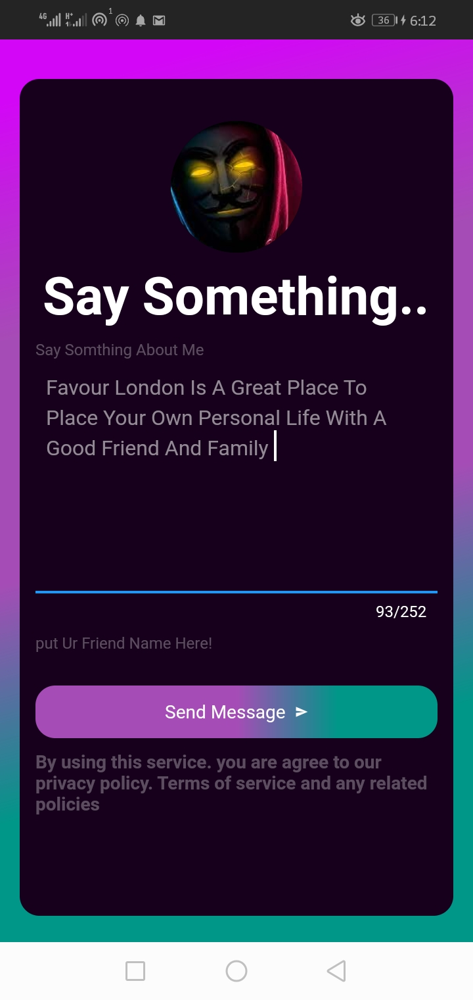
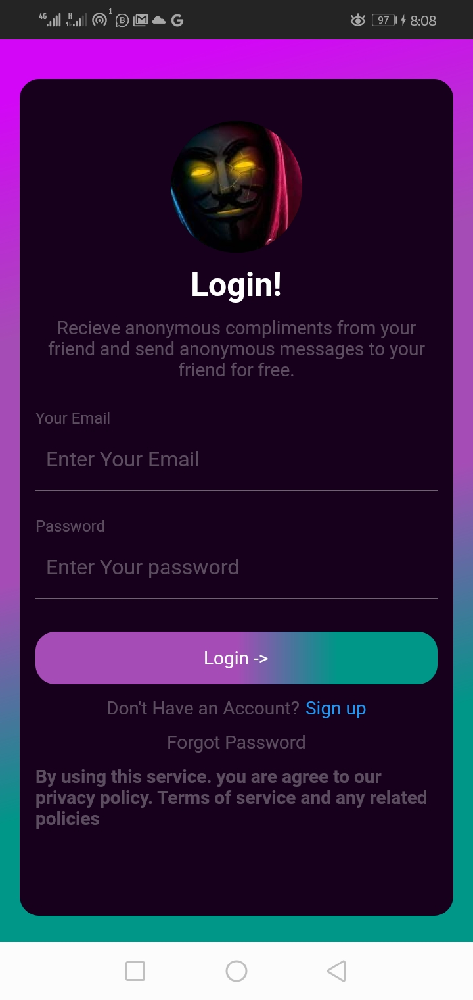
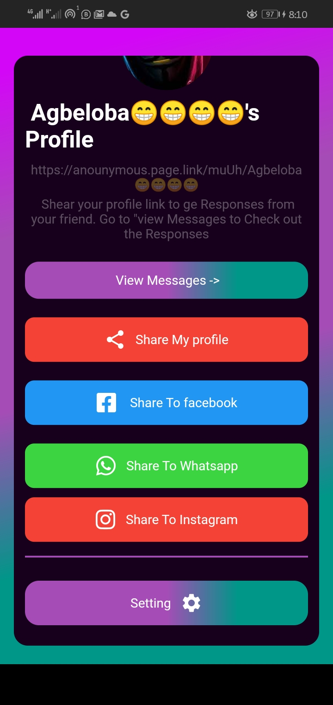
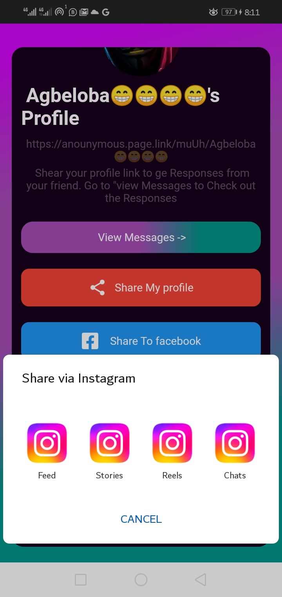
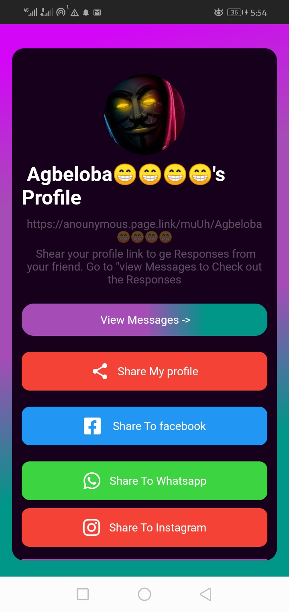
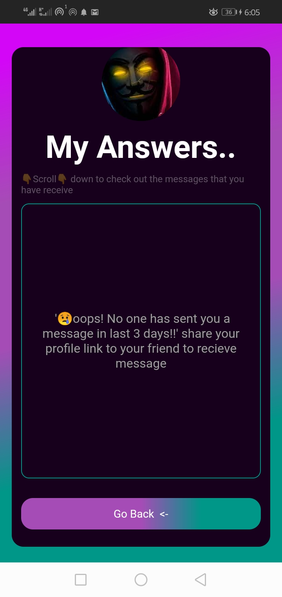
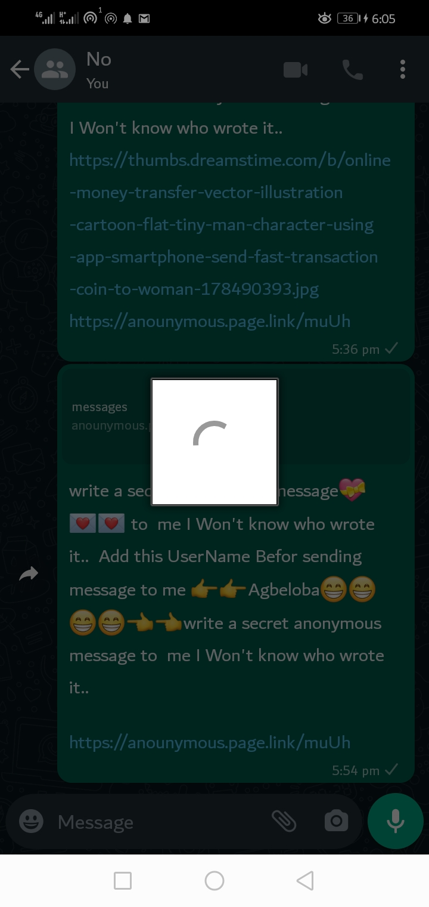
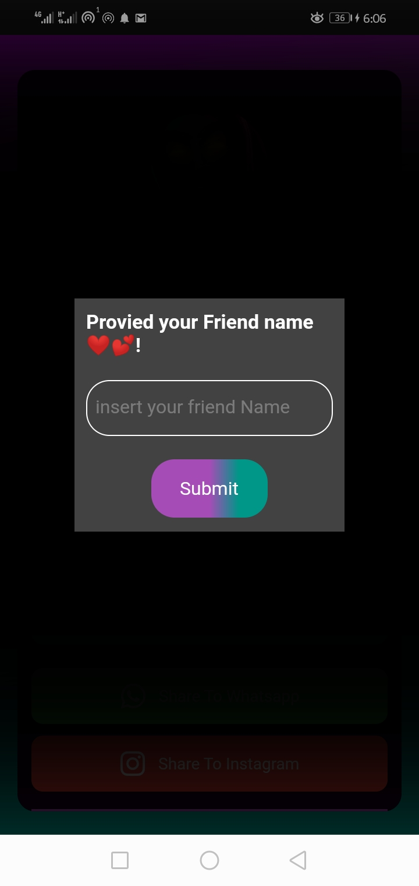
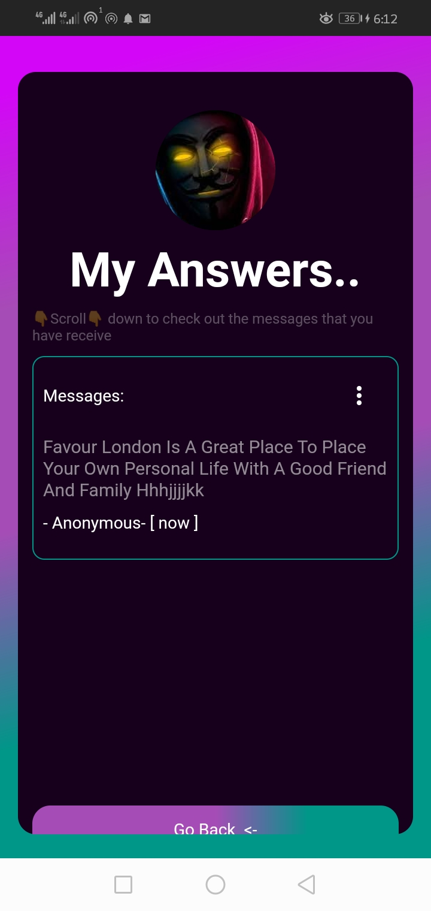
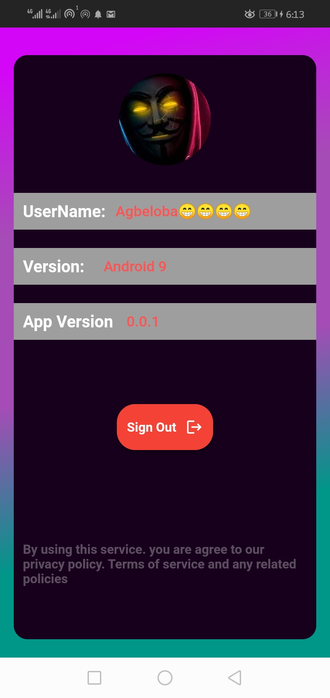
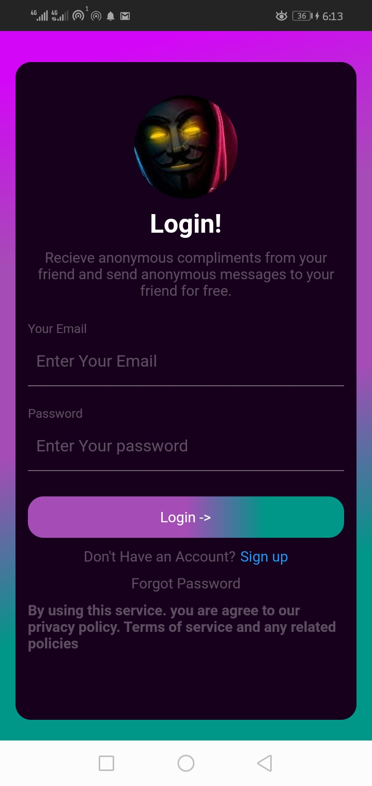
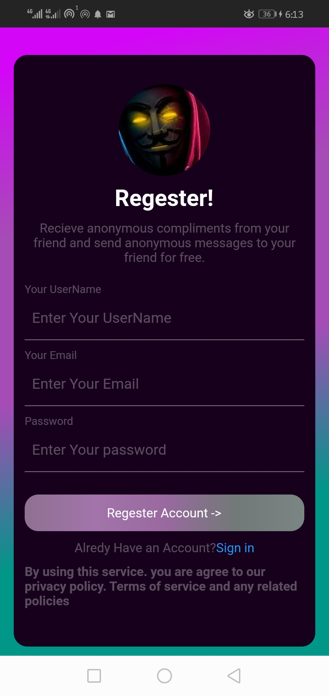

## Firebase Services

This project uses the following Firebase services:

- Firebase Authentication: For user registration, login, and password reset.

- Firebase Firestore: For storing and retrieving messages.

- Firebase Cloud Messaging (FCM): For delivering messages in real-time.

- Firebase Cloud Storage: For storing user profile pictures.

## Getting Started

1. Clone this repository.

2. Set up Firebase for your project by following the instructions in the [Firebase Console](https://console.firebase.google.com/).

3. Update the Firebase configuration in your Flutter project according to the Firebase setup.

4. Run the app on your preferred device or emulator.

## Usage

- Register: Sign up for an account with your email and password.

- Log In: Log in with your registered email and password.

- Reset Password: If you forget your password, you can reset it via email.

- Create Profile: Create and update your user profile, including uploading a profile picture.

- Share Profile: Share your profile link with friends so they can start an anonymous conversation with you.

- Receive Messages: View and respond to anonymous messages from friends.

## Contributing

Contributions are welcome! Feel free to open issues and submit pull requests to help improve the project.

## License

This project is licensed under the MIT License - see the [LICENSE.md](LICENSE.md) file for details.

## Acknowledgments

Special thanks to the Flutter and Firebase communities for their support and contributions.
